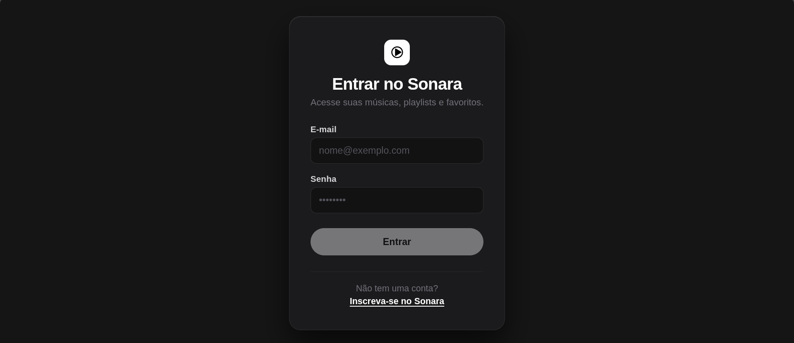

# Sonara 🎵

O **Sonara** é uma plataforma completa de transmissão e gestão musical, desenvolvida com uma arquitetura desacoplada e profissional: um cliente web moderno em **Angular**, uma API robusta em **Java 21 / Spring Boot 3**, persistência relacional com **PostgreSQL**, suporte a execução via **Docker** e alojamento contínuo na nuvem.

---

## 📸 Screenshots

| Login | Músicas Curtidas |
|---|---|
|  |  |

---

## 📑 Índice

* [Screenshots](#-screenshots)
* [Arquitetura da Solução](#-arquitetura-da-solução)
* [Funcionalidades](#-funcionalidades)
* [Stack Tecnológica Completa](#-stack-tecnológica-completa)
* [Estrutura do Repositório](#-estrutura-do-repositório)
* [Documentação da API (Swagger UI)](#-documentação-da-api-swagger-ui)
* [Testes Automatizados](#-testes-automatizados)
* [Configuração de Variáveis de Ambiente](#-configuração-de-variáveis-de-ambiente)
* [Como Executar o Projeto](#-como-executar-o-projeto)
  * [Execução Completa com Docker Compose](#1-execução-completa-com-docker-compose-recomendado)
  * [Execução Manual (Desenvolvimento Local)](#2-execução-manual-desenvolvimento-local)
* [Implementação (Deploy)](#-implementação-deploy)
* [Licença](#-licença)

---

## 🏛️ Arquitetura da Solução

O projeto está estruturado em monorepo contendo dois módulos principais e totalmente desacoplados:

* **Frontend (SPA):** Interface reativa desenvolvida em Angular com TypeScript, consumindo a API REST de forma autenticada via cabeçalhos HTTP (`Authorization: Bearer <token>`).
* **Backend (API RESTful):** Desenvolvido em Spring Boot com Spring Security, gestão de sessões stateless via JWT, validação de integridade de dados e arquitetura em camadas.
* **Banco de Dados Relacional:** PostgreSQL gerido via Spring Data JPA e Hibernate, com mapeamentos de entidades estruturados para relacionamentos N:N e 1:N (listas de reprodução, faixas, avaliações e favoritos).

---

## ✨ Funcionalidades

* **Autenticação & Segurança:** Registo e login de utilizadores com encriptação BCrypt e emissão de tokens JWT seguros.
* **Catálogo de Áudio:** Exploração e reprodução de faixas, artistas e álbuns.
* **Gestão de Listas de Reprodução (Playlists):** Criação, edição, exclusão e reordenação de faixas com validação rigorosa de posse (*ownership*).
* **Favoritos:** Marcação e gestão de faixas prediletas pelo utilizador autenticado.
* **Classificações (Ratings):** Sistema de pontuação e avaliação de faixas de 1 a 5 estrelas.
* **Tratamento de Exceções Centralizado:** Retorno padronizado de erros HTTP (400, 401, 403, 404, 409) através de um gestor global.

---

## 🛠️ Stack Tecnológica Completa

| Camada | Tecnologia | Detalhes |
| --- | --- | --- |
| **Frontend** | Angular | Aplicação Single Page em TypeScript |
| **Backend** | Java 21 & Spring Boot 3.5.14 | API REST com gestão de ciclo de vida Maven |
| **Segurança** | Spring Security + JJWT 0.12.6 | Controlo de acesso granular e tokens JWT |
| **Base de Dados** | PostgreSQL | Armazenamento relacional e integridade referencial |
| **ORM** | Spring Data JPA / Hibernate | Abstração de persistência e repositórios desacoplados |
| **Documentação** | SpringDoc OpenAPI 2.8.5 | Interface gráfica interativa (Swagger UI 3.1) |
| **Qualidade & Testes** | JUnit 5 + Mockito + MockMvc | 33 testes automatizados (unitários, web e segurança) |
| **DevOps** | Docker / Docker Compose | Contentorização multi-stage e orquestração de serviços |
| **CI/CD** | GitHub Actions | Pipeline automatizada de build e testes |
| **Alojamento (Web)** | Vercel | Implementação contínua da aplicação de frontend |

---

## 📁 Estrutura do Repositório

```text
Sonara/
├── backend/                       # API REST em Spring Boot
│   ├── src/
│   │   ├── main/java/io/sonara/
│   │   │   ├── config/            # Segurança, CORS e OpenAPI/Swagger
│   │   │   ├── controller/        # Controladores REST da API
│   │   │   ├── dto/               # Objetos de transferência de dados (DTOs)
│   │   │   ├── exception/         # Tratamento global de erros
│   │   │   ├── model/             # Entidades relacionais JPA
│   │   │   ├── repository/        # Repositórios Spring Data JPA
│   │   │   ├── security/          # Filtros JWT e UserDetailsService
│   │   │   └── service/           # Regras de negócio e validações
│   │   └── test/                  # Suíte completa de testes automatizados
│   ├── Dockerfile                 # Construção multi-stage da API
│   └── pom.xml                    # Gestor de dependências do ecossistema Java
│
├── frontend/                      # Aplicação web SPA
│   ├── src/                       # Componentes, serviços, rotas e estilos Angular
│   ├── package.json               # Dependências do ecossistema Node/TypeScript
│   └── angular.json               # Configurações de compilação da interface
│
├── .github/workflows/             # Pipeline de CI/CD (GitHub Actions)
├── docker-compose.yml             # Orquestração local de base de dados e serviços
└── README.md                      # Documentação geral do ecossistema
```

---

## 📖 Documentação da API (Swagger UI)

A API disponibiliza documentação interativa através da especificação OpenAPI 3:

* **Swagger UI (local):** `http://localhost:8080/swagger-ui/index.html`
* **Swagger UI (produção):** `https://sonara-backend-kh00.onrender.com/swagger-ui/index.html`
* **OpenAPI Spec (JSON):** `http://localhost:8080/v3/api-docs`

> **Autenticação no Swagger:**
> 1. Efetue a requisição em `POST /auth/login` para recolher o token JWT.
> 2. Clique no botão **Authorize** (ou **Autorizar**) no topo da interface.
> 3. Cole o token gerado para desbloquear a execução dos endpoints protegidos.

---

## 🧪 Testes Automatizados

A estabilidade e fiabilidade do backend são validadas por **33 testes automatizados**:

* **Camada de Serviços (Unitários):** Isolamento total via Mockito para validação de regras de negócio, bloqueio de avaliações inválidas e regras de acesso de utilizador.
* **Camada Web (Integração de Controladores):** Uso de `MockMvc` para validar status HTTP (200, 201, 204, 404, 409), serialização JSON e mapeamento de exceções.
* **Camada de Segurança:** Validação de filtros para bloqueio de acessos anónimos a rotas protegidas e libertação de rotas públicas.

Para executar os testes do backend:

```bash
cd backend
./mvnw test
```

---

## ⚙️ Configuração de Variáveis de Ambiente

Crie um ficheiro `.env` na raiz do diretório `backend` (ou configure os valores nas variáveis do contentor/nuvem):

```env
# Base de Dados
SPRING_DATASOURCE_URL=jdbc:postgresql://localhost:5432/sonara_db
SPRING_DATASOURCE_USERNAME=postgres
SPRING_DATASOURCE_PASSWORD=postgres

# JPA / Hibernate
SPRING_JPA_HIBERNATE_DDL_AUTO=update
SPRING_JPA_SHOW_SQL=false

# Autenticação JWT
JWT_SECRET=chave_secreta_jwt_longa_e_aleatoria_com_mais_de_256_bits
JWT_EXPIRATION=86400000

# CORS
CORS_ALLOWED_ORIGINS=http://localhost:4200,https://sonara-amber.vercel.app
```

---

## 🚀 Como Executar o Projeto

### 1. Execução Completa com Docker Compose (Recomendado)

Inicie todos os contentores do ecossistema através de um único comando:

```bash
# Construir e iniciar os contentores em segundo plano
docker compose up -d --build

# Inspecionar os registos de execução (logs)
docker compose logs -f

# Parar a execução dos serviços
docker compose down
```

---

### 2. Execução Manual (Desenvolvimento Local)

#### Executar o Backend

Certifique-se de que possui o **Java 21** e uma instância ativa do **PostgreSQL** na sua máquina:

```bash
cd backend
./mvnw clean spring-boot:run
```

*A API ficará disponível em `http://localhost:8080`.*

#### Executar o Frontend

Certifique-se de que possui o **Node.js** (versão 18 ou superior) instalado:

```bash
cd frontend
npm install
npm start
```

*A interface web ficará acessível em `http://localhost:4200`.*

---

## 🌐 Implementação (Deploy)

* **Frontend:** Alojado e sincronizado através da Vercel: [sonara-amber.vercel.app](https://sonara-amber.vercel.app)
* **Backend:** Empacotado via contentor Docker e implementado no Render, integrado com base de dados PostgreSQL gerida: [sonara-backend-kh00.onrender.com](https://sonara-backend-kh00.onrender.com)

> ⚠️ O backend está hospedado no plano gratuito do Render, que hiberna após inatividade — a primeira requisição após um período parado pode levar cerca de 50 segundos para responder.

---

## 📄 Licença

Este projeto está distribuído sob a licença [MIT](LICENSE). Desenvolvido por [Jacó Lima](https://github.com/benjaexz).
